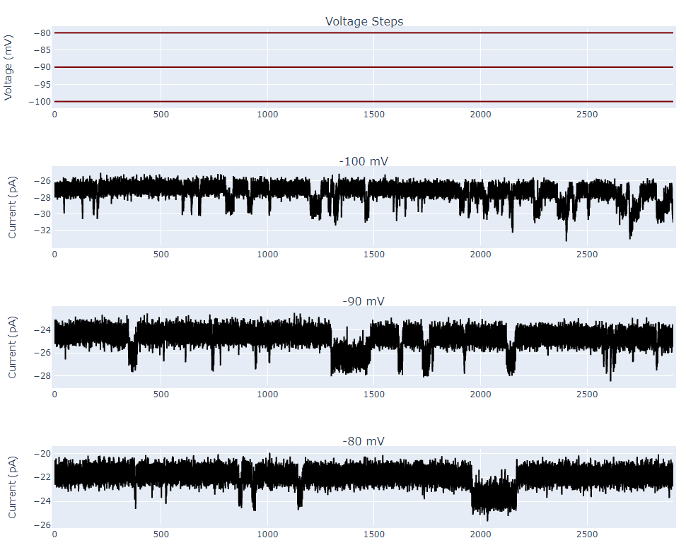
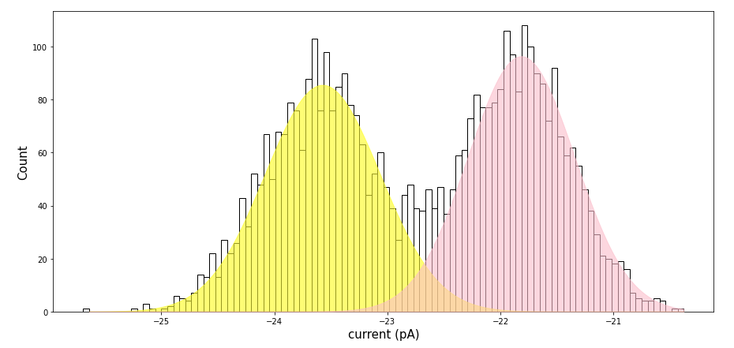
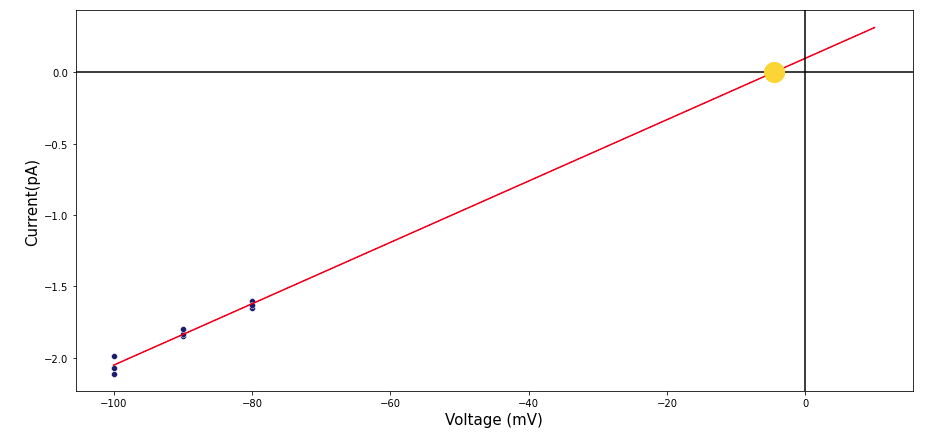

# **Description**
This notebook is meant to be used as a tool to learn about the process of analysing data of single channel opening and closng events. Primarily, this notebook provides detailed explanation on how to determining a channels reversal potential and initary conductance from real electrophysiology data. To accomplish this, this notebook allows users to identify single channel opening events, generate current frequency histograms, plot single channel currents, and then calculate the reversal potential and unitary conductance of a specific ion channel.

# **Examples**
Visualize real electrophysiology data and identify single channel channel openings at various voltages.

***Fig 1:*** *Top trace: Voltages that were recorded at. Bottom three traces: raw current traces at different holding potentials with visable single channel opening events.*

Generate current frequency histograms from single channel opening events with appropriate double Gaussian fits.

***Fig 2:*** *Frequency histogram showing all current values recorded from a single channel opening event. Pink and yellow overlay shows the Gaussian fit used to determine the absolute current passing through the channel at a given voltage*

Determine reversal potential and single channel conductance from various single channel openings.

***Fig 3:*** *Ploted single channel current data which fit with a linear function showiing the reversal potential of the chanel of interest*

# **Getting Started**

## Dependencies
- Python ^3.9 (other versions not guaranteed)
## Installing
- git clone https://github.com/msindoni/single_channel_alanysis.git
- •conda env create -f requirements.txt
# **Executing Program**
### Variables/Inputs
- All inputs necessary are explained in detail in the notebook for the cells they are relevant to.
### Other Details
 -  Sample data used in this notebook is a csv file that originates from a asc file. The original data was collected from a HEKA amplifier using PatchMaster but the format was modified for this exercise to make it more user friendly.
# **Authors**
- Michael Sindoni msindoni22@gmail.com

# **License**
This project is licensed under the MIT License - see the LICENSE file for details
